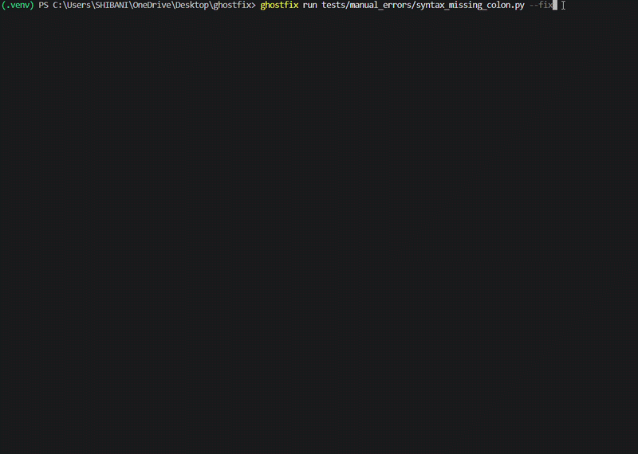

# GhostFix AI

<p align="center">
  <strong>No prompts. Just logs. Instant diagnosis.</strong>
</p>

<p align="center">
  <a href="https://github.com/Shibani987/ghostfix-ai/actions/workflows/ci.yml">
    
  </a>

 <a href="https://pypi.org/project/ghostfix-ai/">
  
</a>

<a href="https://pypi.org/project/ghostfix-ai/">
  
</a>

  <a href="LICENSE">
    
  </a>
</p>

GhostFix is a local-first runtime debugging CLI that watches terminal and dev-server logs, detects crashes automatically, explains likely root causes, and applies only safety-gated deterministic fixes. Python auto-fix is the mature path; JavaScript and TypeScript fixes are limited to guarded allowlisted patch previews. No API key required. Local-first by default.


## See GhostFix in Action

<p align="center">
  
</p>

## Quick install

```bash
pip install ghostfix-ai
ghostfix setup
ghostfix demo
```

## Debug a crash

```bash
ghostfix run app.py
ghostfix watch "python manage.py runserver"
ghostfix watch "npm run dev"
ghostfix watch "pnpm dev"
ghostfix watch "next dev"
ghostfix watch "uvicorn main:app --reload"
ghostfix watch "flask run"
ghostfix watch "php artisan serve"
```

## Command Matrix

| Command | Runtime Inference | Auto-fix posture |
| --- | --- | --- |
| `python app.py`, `python main.py`, `python run.py` | Python script, Flask/FastAPI hints when imports exist | Mature Python allowlist |
| `python manage.py runserver` | Django | Suggestions plus Python allowlist |
| `flask run` | Flask | Suggestions plus Python allowlist |
| `uvicorn main:app --reload` | FastAPI/Uvicorn | Suggestions plus Python allowlist |
| `node server.js`, `npm start`, `npm run dev` | Node/Express or package-script framework | JS/TS tiny allowlist only |
| `npm run dev`, `pnpm dev`, `next dev`, `vite` | Next.js or React/Vite from package markers | JS/TS tiny allowlist only |
| `tsc --noEmit`, `npm run build` | TypeScript/build | Suggestions; simple JS/TS allowlist when exact source target exists |
| `php artisan serve`, `php index.php` | PHP/Laravel | PHP missing-semicolon allowlist only |

GhostFix also detects tooling and wrong-root failures before or after startup:
missing `pnpm`, `npm`, `node`, `php`, `uvicorn`, `flask`, missing `manage.py`, missing `package.json`, missing `server.js`, missing Laravel `artisan`, missing `tsconfig.json`, and invalid Next.js roots.

## Why GhostFix?

| Feature | Description |
| --- | --- |
| Promptless runtime debugging | No prompts needed—just run your code and get instant diagnosis from logs. |
| Local-first by default | Works entirely offline, no API keys or cloud dependencies required. |
| No API key required | All processing happens locally on your machine. |
| Watch mode for dev servers | Monitors long-running processes and catches errors in real-time. |
| Safety-gated fixes | Python fixes are mature; JS/TS fixes are limited, allowlisted, previewed, backed up, and rollback-aware. |

## Safety-first

GhostFix does not silently rewrite code. Fixes are offered only for narrow deterministic cases, with patch preview, validation, backup, and rollback metadata. Non-allowlisted framework, config, dependency, external-service, auth, database, payment, and security-sensitive cases are suggestion-only.

## Current status

Production-minded local debugging CLI. Enterprise-evaluation-ready candidate. Not a hosted observability platform or unrestricted autonomous coding agent.

## What Works Now

- Python traceback detection and diagnosis.
- Structured streaming log-event pipeline for noisy, partial, and long-running logs.
- Repo-aware context for project roots, dependency files, framework hints, and related local files.
- Safe deterministic Python auto-fix for a small allowlisted set of cases.
- Guarded JS/TS patch previews for very low-risk allowlisted fixes such as missing semicolon repair and exact relative import extension repair.
- PHP/Laravel basic log diagnosis and guarded PHP missing-semicolon previews when `php -l` validation is available.
- Watch mode for terminal and server processes.
- Django, Flask, FastAPI, and Uvicorn startup/runtime diagnosis.
- JavaScript, Node.js, TypeScript, React, and Next.js dev-log diagnosis.
- Framework-aware Next.js suggestions for module resolution, missing env vars, API route 500s, Ollama/local-service failures, build/syntax errors, TypeScript errors, port conflicts, and hydration-style messages.
- PHP error detection.
- Brain v4 runtime routing as an optional guarded local reasoning layer.
- Local incident history in `.ghostfix/incidents.jsonl`.
- Local stats and redacted training-data exports for user-reviewed closed-beta feedback.
- Local production-like log classification for user-provided logs, with anomaly rules for auth spikes, repeated failures, 5xx errors, and timeout clusters.
- Benchmarks for watch mode and Brain v4 routing.
- Local-first operation with no required external API calls.

## What Does Not Work Yet

- Broad JavaScript, TypeScript, React, Next.js, and PHP auto-fix is intentionally disabled.
- JS/TS patching is limited and experimental; only allowlisted one-line source repairs may be offered.
- Framework configuration fixes are diagnosis-only.
- Repo-aware multi-file edits are not part of the current MVP.
- Brain v4 output is advisory and cannot bypass safety policy.
- CPU generation with Brain v4 can be slow, especially on Windows.
- GhostFix is not a security scanner, full static analyzer, or production observability platform.
- Sentry, PostHog, and Clarity support is currently architecture hooks only; GhostFix does not secretly monitor production systems or call external telemetry services.

## Daily-Driver Beta Limitations

GhostFix is ready for local daily trial use, but it is still a beta-quality developer tool:

- Python runtime diagnosis is the most mature path.
- Node, JavaScript, TypeScript, React, Next.js, and PHP support is strongest for diagnosis and suggestions; JS/TS patching is intentionally narrow.
- Framework configuration issues are explained, not auto-edited.
- Brain v4 is optional and advisory.
- Auto-fix covers narrow deterministic Python patches plus tiny JS/TS/PHP/setup allowlists with confirmation, backup or create-file rollback metadata, audit, and rollback.
- Long-running watch mode is bounded and duplicate-aware, but it is not a full observability system.

## Safety Guarantees

- GhostFix does not silently rewrite files.
- Auto-fix is blocked unless the safety policy allows a deterministic validated patch.
- Patch previews are shown before confirmation unless explicitly auto-approved.
- Applied safe fixes create backups.
- Rollback uses local backup metadata and asks before restoring.
- Brain output cannot bypass the safety policy.

## Trust & Safety

Use dry-run when you want diagnosis without any file writes:

```powershell
ghostfix run tests/manual_errors/name_error.py --dry-run
ghostfix watch "python demos/python_name_error.py" --dry-run
```

Auto-fix decisions are audited locally in `.ghostfix/fix_audit.jsonl`:

```powershell
ghostfix audit
ghostfix audit --last 10
```

Dry-run, rollback, and audit behavior are documented in [docs/TRUST_AND_SAFETY.md](docs/TRUST_AND_SAFETY.md).

## Closed Beta Trial

Before inviting a small group of 2-5 developers, run:

```powershell
ghostfix beta-check
```

Closed beta users should start with `ghostfix quickstart`, `ghostfix examples`,
and dry-run mode. The closed beta guide is in
[docs/CLOSED_BETA_GUIDE.md](docs/CLOSED_BETA_GUIDE.md). GhostFix is still a
local developer beta, not an enterprise production platform.

## What GhostFix Will Never Do

- It will never upload your code, logs, incidents, or feedback without an explicit feature and configuration.
- It will never enable broad autonomous coding from watch mode.
- It will never apply JavaScript, framework config, dependency install, database, network, or destructive filesystem fixes automatically.
- It will never run `npm install`, `pnpm install`, or dependency installation automatically.
- It will never treat model confidence alone as permission to edit files.

## Local-First Promise

GhostFix works locally by default. Incidents, feedback, daemon state, and reports are written under `.ghostfix/`. Optional cloud memory hooks require explicit configuration; local diagnosis does not require external APIs.

Default configuration is local-only:

```powershell
ghostfix config init
ghostfix config show
```

The default policy disables auto-fix by default, disables telemetry, disables export until manually invoked, and keeps Brain mode off unless explicitly configured.

## No Automatic Telemetry

GhostFix does not automatically upload incidents, feedback, logs, snippets, audit history, or training exports. Local feedback collection writes to `.ghostfix/feedback.jsonl`, and training exports are files you create and review manually.

## Training Data Export

Closed-beta users can summarize local usage and create a redacted export for manual review:

```powershell
ghostfix stats
ghostfix export-training-data
ghostfix export-training-data --include-snippets
```

Exports are written under `.ghostfix/exports/` and include diagnosis, feedback, rollback, and validator fields useful for improving local retrieval and future local models. The export command prints `No data was uploaded.` every time.

Details are in [docs/TRAINING_DATA_EXPORT.md](docs/TRAINING_DATA_EXPORT.md).

## Future Local Model Improvements

User-reviewed exports can help improve future local models and deterministic retrieval quality without requiring automatic telemetry. Shared exports should be inspected first, especially when snippets are included.

## 2 Minute Quickstart

```powershell
python -m venv .venv
.\.venv\Scripts\Activate.ps1
pip install -e .
ghostfix doctor
ghostfix quickstart
```

## Install From Source

Current beta installs from a local clone:

```powershell
git clone <private-repo-url>
cd ghostfix
python -m venv .venv
.\.venv\Scripts\Activate.ps1
python -m pip install -e .
ghostfix doctor
```

For a local wheel rehearsal:

```powershell
python -m build
python -m pip install dist\ghostfix_ai-0.6.0-py3-none-any.whl
ghostfix --version
```

Packaging details are in [docs/PACKAGING.md](docs/PACKAGING.md).

## Installation

GhostFix is available on PyPI as `ghostfix-ai` with the `ghostfix` console command.

```bash
pip install ghostfix-ai
```

Optional ML, Brain, and cloud-memory dependencies are separate extras:

```bash
pip install "ghostfix-ai[retriever]"
pip install "ghostfix-ai[brain-v4]"
pip install "ghostfix-ai[cloud-memory]"
```

For development or local builds, use editable install or a locally built wheel from the repository.

Run a file and diagnose the failure:

```powershell
ghostfix run tests/manual_errors/name_error.py
ghostfix run tests/manual_errors/name_error.py --verbose
```

Try watch mode:

```powershell
ghostfix watch "python demos/python_name_error.py"
ghostfix watch "npm run dev" --cwd demos/node_like
```

Useful onboarding commands:

```powershell
ghostfix examples
ghostfix incidents
ghostfix feedback --good
ghostfix rollback last
```

The module entry point still works for development and troubleshooting:

```powershell
python -m cli.main doctor
python -m cli.main run tests/manual_errors/name_error.py
```

## Demo Commands

```powershell
python -m cli.main run tests/manual_errors/name_error.py
python -m cli.main run tests/manual_errors/name_error.py --verbose
python -m cli.main run tests/manual_errors/json_empty_v2.py --fix
python -m cli.main watch "python demos/python_name_error.py"
python -m cli.main watch "python demos/django_like/manage.py runserver"
python -m cli.main watch "python demos/fastapi_like/main.py"
python -m cli.main watch "npm run dev" --cwd demos/node_like
```

More commands are collected in [docs/DEMO_COMMANDS.md](docs/DEMO_COMMANDS.md).
The short install path is in [docs/QUICKSTART.md](docs/QUICKSTART.md), and categorized command examples are in [docs/EXAMPLES.md](docs/EXAMPLES.md).

After `pip install -e .`, the same demos can be run through the installed CLI:

```powershell
ghostfix doctor
ghostfix --version
ghostfix run tests/manual_errors/name_error.py
ghostfix watch "python demos/python_name_error.py"
ghostfix context tests/manual_errors/name_error.py
ghostfix classify-log path/to/log.txt
ghostfix verify-release
ghostfix validate-production
ghostfix daemon start "python demos/python_name_error.py"
ghostfix daemon status
ghostfix daemon stop
ghostfix incidents
ghostfix stats
ghostfix export-training-data
ghostfix incidents --last 10
```

`validate-production` is a local release-validation gate. Passing it supports an enterprise-evaluation-ready claim; it does not make GhostFix a hosted enterprise observability platform.

## Watch Mode

Watch mode runs a command, streams output live, and opens a GhostFix diagnosis when it sees a runtime error.

```powershell
python -m cli.main watch "python demos/python_name_error.py"
python -m cli.main watch "python demos/django_like/manage.py runserver"
python -m cli.main watch "python demos/fastapi_like/main.py"
python -m cli.main watch "npm run dev" --cwd demos/node_like
```

Useful options:

- `--verbose`: show routing, Brain telemetry, evidence, patch safety, and context.
- `--cwd PATH`: run the watched command from another directory.
- `--no-brain`: disable Brain routing/generation for the session.
- `--brain-mode auto|off|route-only|generate`: select Brain v4 runtime behavior.
- `--fix`: allow the existing deterministic Python auto-fix prompts.

Watch mode does not silently rewrite code. Non-Python errors remain diagnosis-only.

## Repo Context

GhostFix can inspect bounded, safe repo context for a file:

```powershell
ghostfix context tests/manual_errors/name_error.py
```

The context engine detects project root markers, common Python/Node dependency files, framework hints, and related local files. It ignores secret files such as `.env`, skips heavy/generated directories such as `.git`, `node_modules`, `venv`, `.venv`, `dist`, and `build`, and enforces file and character budgets.

## Production-Like Log Classification

GhostFix can classify a local log file into a production-style runtime category without external API calls:

```powershell
ghostfix classify-log path/to/log.txt
```

The classifier detects expected user errors, app bugs, infrastructure errors, dependency errors, auth anomalies, repeated failures, and unknown cases. It also reports severity, anomaly hints, and whether Brain escalation is needed. Normal expected user errors, such as a single wrong-password 401, do not trigger heavy Brain reasoning.

Current Sentry, PostHog, and Clarity modules are disabled-by-default local interfaces only. Future production mode would require explicit user-provided logs, events, or API access.

## Daemon Mode

Daemon v1 runs in the foreground and reuses watch mode to continuously monitor a local dev command. It records incidents to `.ghostfix/incidents.jsonl`, suppresses repeated adjacent duplicates, and shuts down cleanly on Ctrl+C.

```powershell
ghostfix daemon start "python demos/python_name_error.py"
ghostfix daemon status
ghostfix daemon stop
```

In v1, `status` reads local daemon state from `.ghostfix/daemon.json`, and `stop` writes a local stop request for the foreground daemon loop. Auto-fix behavior remains the same guarded watch-mode behavior and requires `--fix`.

## Incident History

GhostFix records local debugging incidents to `.ghostfix/incidents.jsonl`. Each JSONL row includes the timestamp, command, file, language, runtime, error type, likely cause, suggested fix, confidence, whether auto-fix was available, and whether the command was resolved after an applied fix.

```powershell
ghostfix incidents
ghostfix incidents --last 10
```

Repeated adjacent duplicates are suppressed so a crashing watch command does not flood history with the same incident. Incident memory is local history only; it does not retrain Brain v4 and does not weaken the safety policy.

## Safe Auto-Fix Example

```powershell
python -m cli.main run tests/manual_errors/json_empty_v2.py --fix
```

Auto-fix is intentionally narrow. GhostFix creates a `*.bak_YYYYMMDD_HHMMSS` backup, validates the generated Python patch, and only applies fixes covered by the safe policy. Missing packages, framework config errors, JavaScript, TypeScript, PHP, and ambiguous project-intent cases are blocked.

For auto-fix, GhostFix validates the patch in a temporary sandbox copy before touching the real file. Incident records include rollback metadata when a patch is attempted.

See [docs/SAFETY.md](docs/SAFETY.md).

## Brain v4 Modes

Brain v4 is an optional local LoRA reasoning layer. It does not replace deterministic rules, memory, or retrieval.

- `auto`: normal gated runtime mode. Brain is used only when the fast layers need help.
- `off`: disables Brain v4.
- `route-only`: measures whether a case would escalate, but skips generation.
- `generate`: runs Brain generation for escalated cases; useful for small quality checks.

Compatibility check:

```powershell
python ml/check_brain_v4_model.py
```

Optional local base model download:

```powershell
pip install huggingface_hub transformers peft accelerate torch
python ml/download_base_model.py
```

Downloaded model weights and checkpoints are local-only and intentionally ignored by Git.

Benchmark routing:

```powershell
python ml/evaluate_runtime_brain_v4.py --dir tests/real_world_failures --brain-mode route-only
python ml/evaluate_runtime_brain_v4.py --dir tests/brain_escalation_cases --brain-mode route-only
```

## Benchmarks

```powershell
python -m unittest discover tests
python -m cli.main verify-release
python -m cli.main validate-production
python ml/evaluate_watch_mode.py
python ml/evaluate_runtime_brain_v4.py --dir tests/real_world_failures --brain-mode route-only
python ml/evaluate_runtime_brain_v4.py --dir tests/brain_escalation_cases --brain-mode route-only
python ml/evaluate_runtime_brain_v4.py --dir tests/brain_escalation_cases --limit 2 --brain-mode generate
```

Benchmark reports are generated under `ml/reports/`, which is intentionally ignored for public release hygiene.

Production validation reports are generated under `.ghostfix/reports/`, which is local runtime state and ignored by Git.

Latest verified public snapshot:

| Area | Result |
| --- | --- |
| Unit/integration tests | `python -m unittest discover tests`: 244 tests, OK |
| Watch mode benchmark | language 100%, runtime 100%, error_type 100%, root_cause 100%, safety 100% |
| Real-world deterministic route-only | 10 files, 7.492s total, 0.749s avg deterministic runtime, 100% deterministic solve rate, 0% unresolved, Brain activations 0/10 |
| Brain escalation route-only | 12 files, 3.435s total, 0.283s avg brain-assisted routing runtime, Brain activations 12/12, Brain escalations 12/12, 58.3% unresolved |
| Brain generate mode | 2 files, 111.337s total, 55.651s avg brain-assisted runtime, 37.740s avg Brain generation, 50% usable Brain output rate |

Interpretation:

- Deterministic rules and watch mode are the current reliable MVP path.
- `route-only` mode proves that hard cases are routed to Brain v4 without paying CPU-heavy generation cost.
- `generate` mode is experimental and slow on CPU. It is useful for small quality probes, not live demos.

## Architecture

GhostFix uses a hybrid pipeline:

1. Run or watch a command.
2. Convert streaming output into bounded structured log events.
3. Detect bounded repo context and framework hints.
4. Classify local production-like runtime signals when a user provides log files.
5. Parse runtime logs and tracebacks.
6. Detect language, runtime, framework, error type, and source location.
7. Apply deterministic rules and known-case memory first.
8. Use retrieval and optional local reasoning for broader diagnosis.
9. Route hard cases to Brain v4 when enabled.
10. Generate a diagnosis, confidence, likely cause, and suggested fix.
11. Offer auto-fix only when the safety policy allows a deterministic Python patch.
12. Write local incident history for later review.

Beginner-friendly details are in [docs/PROJECT_OVERVIEW.md](docs/PROJECT_OVERVIEW.md). A comparison with other tools is in [docs/WHY_DIFFERENT.md](docs/WHY_DIFFERENT.md).

## Files Expected In The Repo

- `agent/`, `cli/`, `core/`, `ghostfix/`, `ml/`, and `utils/` source.
- `tests/` unit, benchmark, manual, and demo fixtures.
- `demos/` watch-mode examples.
- `ml/models/` lightweight required model/retriever artifacts and Brain v4 adapter metadata/tokenizer files. Heavy model weights are downloaded locally and ignored.
- `ml/configs/` model configuration files.
- `docs/` public documentation.
- `requirements.txt`, `pyproject.toml`, `.gitignore`, and release checklist.

Generated reports, caches, local environment files, local feedback/runtime state, and backups are intentionally ignored.

## Limitations

- Python is the mature path.
- JavaScript, TypeScript, and PHP support is diagnosis-only.
- Auto-fix is deliberately conservative.
- Brain v4 requires compatible local model files and optional ML dependencies.
- Brain v4 generation can be slow on CPU.
- GhostFix does not understand every project convention yet.

## Roadmap

- Current MVP: promptless runtime diagnosis, reliability core v1, watch mode, daemon v1, safe Python auto-fix, guarded Brain v4 routing, local incident memory, and local production-like log classification.
- Next: recurring incident summaries and daemon polish.
- Later: VS Code extension.
- Later: repo-aware multi-file fixes.
- Later: stronger local model.
- Later: user-reviewed local training exports for model and retriever improvement.
- Later: CI/CD and observability integrations.

See [docs/ROADMAP.md](docs/ROADMAP.md).

## More Docs

- [docs/SETUP.md](docs/SETUP.md)
- [docs/DEMO_COMMANDS.md](docs/DEMO_COMMANDS.md)
- [docs/SAFETY.md](docs/SAFETY.md)
- [docs/PACKAGING.md](docs/PACKAGING.md)
- [docs/TRAINING_DATA_EXPORT.md](docs/TRAINING_DATA_EXPORT.md)
- [docs/UX.md](docs/UX.md)
- [docs/RELIABILITY.md](docs/RELIABILITY.md)
- [docs/REAL_WORLD_RESULTS.md](docs/REAL_WORLD_RESULTS.md)
- [docs/PRODUCTION_READINESS.md](docs/PRODUCTION_READINESS.md)
- [docs/PRODUCTION_VALIDATION.md](docs/PRODUCTION_VALIDATION.md)
- [docs/PROJECT_OVERVIEW.md](docs/PROJECT_OVERVIEW.md)
- [docs/WHY_DIFFERENT.md](docs/WHY_DIFFERENT.md)
- [RELEASE_CANDIDATE_CHECKLIST.md](RELEASE_CANDIDATE_CHECKLIST.md)
