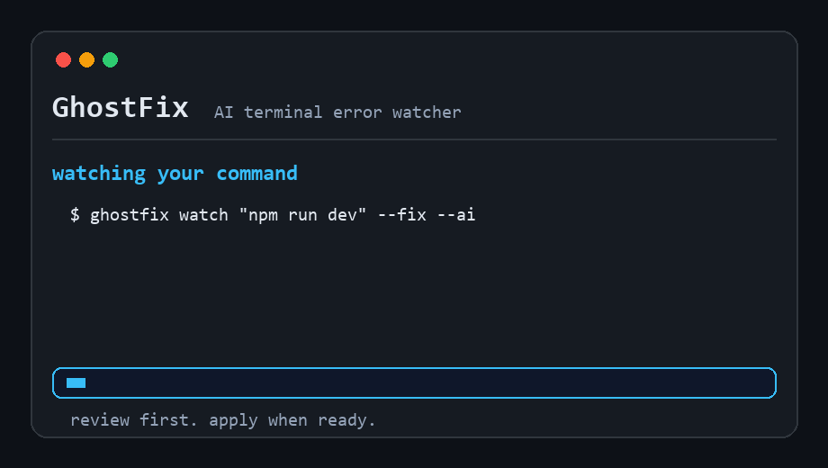
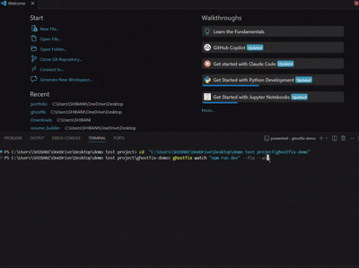

# GhostFix

**AI-powered terminal error watcher and auto-fixer.**

GhostFix watches any command, detects runtime errors, gathers the relevant code context, asks an AI provider for a focused unified-diff patch, and applies the fix from your terminal.



## See GhostFix in Action

<video src="docs/assets/Screen%20Recording%202026-06-06%20143114.mp4" controls width="100%">
Watch the GhostFix demo video.
</video>



[Watch the demo video](docs/assets/Screen%20Recording%202026-06-06%20143114.mp4)

[](https://pypi.org/project/ghostfix/)
[](https://www.python.org/)
[](LICENSE)
[](https://github.com/Shibani987/ghostfix-ai)

## Why GhostFix?

Development servers, test runners, CLIs, scripts, and training jobs fail in noisy ways. GhostFix sits beside the command, reads the error stream, finds the file and line that matter, then proposes a small patch you can review before applying.

GhostFix is built for developers who want fast repair loops without giving up control.

## Features

- Watch any shell command: Next.js, Django, Flask, pytest, Node, Go, Rust, Java, Ruby, and more.
- Detect common error signals and parse stack traces across multiple languages.
- Resolve source files from stack traces and collect nearby code context.
- Use cloud providers: OpenAI, Claude, or Gemini.
- Use local/custom models through Ollama, LM Studio, vLLM, or any OpenAI-compatible endpoint.
- Generate unified-diff patches and apply them with `git apply` first.
- Create backups in `.ghostfix_backups/` before patching.
- Restart the watched command after a successful fix.
- Limit repeated fixes for the same error with retry controls.
- Keep humans in the loop by default with patch confirmation prompts.

## Install

```bash
pip install ghostfix
```

From source:

```bash
git clone https://github.com/Shibani987/ghostfix-ai.git
cd ghostfix-ai
pip install -e .
```

Python 3.9 or newer is required.

## Quick Start

Cloud AI mode:

```bash
ghostfix watch "npm run dev" --fix --ai
```

GhostFix asks for the provider and API key each time `watch --ai` runs. This keeps new terminal sessions from silently reusing an old saved key.

Force a provider but still enter the key for this run:

```bash
ghostfix watch "python manage.py runserver" --fix --ai --provider gemini
```

Local/custom model mode:

```bash
ghostfix init
ghostfix watch "python app.py" --fix
```

Edit the generated `ghostfix.config.py` to point at Ollama, LM Studio, vLLM, or your own model server.

## Commands

| Command | Description |
| --- | --- |
| `ghostfix watch "CMD"` | Watch a command and print its output. |
| `ghostfix watch "CMD" --fix --ai` | Watch and fix using a cloud AI provider. |
| `ghostfix watch "CMD" --fix` | Watch and fix using `ghostfix.config.py` custom model settings. |
| `ghostfix setup` | Save a default cloud provider/API key for setup workflows. |
| `ghostfix init` | Create a project-level `ghostfix.config.py`. |
| `ghostfix config-show` | Show the merged GhostFix configuration with masked API key. |

## Flags

| Flag | Description |
| --- | --- |
| `--fix` | Enable the AI repair pipeline when an error is detected. |
| `--ai` | Use OpenAI, Claude, or Gemini instead of a custom model config. |
| `--provider <name>` | Force `openai`, `claude`, or `gemini`. |
| `--auto` | Apply patches without confirmation. Use carefully. |
| `--config <path>` | Load a specific `ghostfix.config.py`. |
| `--verbose` | Show extra renderer/debug output. |

## How It Works

```text
watched command fails
        |
        v
error parser detects language, error type, file, and line
        |
        v
context builder collects source snippets and project tree
        |
        v
AI provider returns root cause, explanation, and unified diff
        |
        v
GhostFix shows the fix and asks before applying
        |
        v
patcher backs up files, applies patch, and restarts command
```

## Configuration

Create a config file:

```bash
ghostfix init
```

Example:

```python
GHOSTFIX_CONFIG = {
    "model": {
        "type": "custom",
        "endpoint": "http://localhost:11434/api/chat",
        "model_name": "codellama:13b",
    },
    "watch": {
        "ignore": ["node_modules", ".git", "dist", "__pycache__"],
        "max_file_size_kb": 500,
        "context_lines": 60,
    },
    "fix": {
        "auto_apply": False,
        "create_backup": True,
        "restart_on_fix": True,
        "max_retries": 3,
    },
}
```

See [Configuration](docs/CONFIGURATION.md) and [Providers](docs/PROVIDERS.md).

## Supported Error Families

| Ecosystem | Detection | Stack trace parsing |
| --- | --- | --- |
| Python, Django, Flask | Yes | Yes |
| Node.js, TypeScript, Next.js | Yes | Yes |
| Java | Yes | Yes |
| Go | Yes | Yes |
| Rust | Yes | Yes |
| Ruby | Yes | Yes |
| Generic CLI output | Yes | Partial |

## Safety

GhostFix is designed to keep you in control:

- Patches are shown before applying unless `--auto` is enabled.
- Backups are created before patching by default.
- The same error is not fixed forever; retry limits stop loops.
- Project scanning ignores common generated folders.
- API keys are masked in `config-show`.

Read [Security](SECURITY.md) before using GhostFix on sensitive repositories.

## Documentation

- [Installation](docs/INSTALLATION.md)
- [Configuration](docs/CONFIGURATION.md)
- [Providers](docs/PROVIDERS.md)
- [Architecture](docs/ARCHITECTURE.md)
- [Troubleshooting](docs/TROUBLESHOOTING.md)
- [Release Checklist](docs/RELEASE_CHECKLIST.md)
- [Contributing](CONTRIBUTING.md)
- [Changelog](CHANGELOG.md)

## Release Status

Current version: `0.1.0`

This is an early release. The core loop is ready for testing, but patch quality depends on the chosen AI model and the context available in the error output.

## License

MIT. See [LICENSE](LICENSE).
